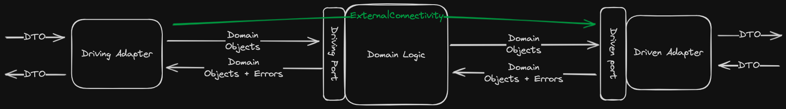

# Architecture Layers

This microservice template is built using [Hexagonal Architecture](https://medium.com/ssense-tech/hexagonal-architecture-there-are-always-two-sides-to-every-story-bc0780ed7d9c).
**Please read that overview before moving forward, terminology from it will be used in this document.**

The app is built using the standard hexagon layout:
* The HTTP-based driving adapters are implemented in the [API Package](../src/api/mod.rs)
* The domain logic is implemented in the [Domain Package](../src/domain/mod.rs)
* The driven adapters (just SQL connections for now) are implemented in the [Persistence package](../src/persistence/mod.rs)

## Layer Interactions

### Domain layer
The domain layer should define all its interactions with the other layers. This means defining submodules for some set of
functionality called `driving_ports` and `driven_ports`, including the return types and error types that are either received
from or passed to adapters interacting with the domain.

Functions able to be called from driving adapters should be exposed through the driving port and implemented in the 
domain. Other functions can be defined to support the domain logic, but they don't need to be included on the driving port
unless they need to be called from a driving adapter.

For testability, driving ports should accept driven port implementations so ownership plays nicely with your code (basically,
ownership of everything trickles down from the driving adapter).

### Driving adapters (HTTP routing)
Driving adapters should handle protocol-specific details for triggering logic in the domain. This means accepting and responding
with DTOs (Data Transfer Objects), and converting these DTOs into domain types before invoking domain functionality through
the driving port. Conversely, when a domain type or domain error is passed back to a driving adapter, they should be converted
into DTOs before they go over the wire. The HTTP response code should be determined based on the semantics of either a successful
operation or the specific domain error received from the driving port.

Driving adapters have a "special" method of interaction with driven ports on the other side of the hexagon - only driving
adapters may start database transactions, as the domain must be ignorant of underlying technologies it interacts with.
This also supports propagating the same database transaction across multiple calls into the domain. 

This is all facilitated through the **ExternalConnectivity** trait, which provides accessors for driven adapters to contact 
external systems. It also provides an abstraction over SQLX's [Transaction](https://docs.rs/sqlx/latest/sqlx/struct.Transaction.html) 
and [PoolConnection](https://docs.rs/sqlx/latest/sqlx/pool/struct.PoolConnection.html) types so database
connection code can be written in a way that's agnostic of whether the app communicates with the database in the middle 
of a transaction or via a standard database connection.

### Driven adapters (database and other external systems)
Driven adapters should handle protocol-specific details to help facilitate the domain's communication with external systems.
They should implement the driven port interface defined by the domain and convert domain types into DTOs (Data Transfer Objects)
before sending data over the wire. Acquiring the connection to the outside world can be done by accepting something implementing
the **ExternalConnectivity** trait.

The driving adapter should then translate the DTO it receives back into a domain type, or if an error is received it should
either be translated into a predefined domain error or be returned as a catch-all "port error". This way the domain
can respond appropriately to errors without having knowledge of the underlying implementation.

### TL;DR



## Implementation of each layer

To demonstrate how to write out each layer, we'll walk through writing the domain logic and the ports associated with
it. Let's imagine we're defining an API where we're registering players for a game. The incoming DTO will have some
basic validation, but the user may not have the same username as another player.

### Implementing the domain layer

Ports should have a narrow focus and shouldn't grow to more than about 8 to 10 available functions. If you go beyond that,
it's likely that the port is doing too much, and it should be decomposed into more focused ports. As a reminder, a **driven port**
allows the domain logic to communicate with external systems. It will need an `ExternalConnectivity` instance in order to do so.
Additionally, a **driving port** will expose the domain's functionality to driving adapters in higher layers.

#### Driven Port

Let's start with the driven port. We'll need to define our inputs and outputs for our business logic, including any
expected errors. Each set of ports will be defined in their own submodule.

<details>
<summary>Code example for driven port definition</summary>

```rust
// Pretend this file is domain/player.rs

// Domain objects are defined at the module level
// Structs containing data for specific operations should be defined
// separately from structs that contain a full set of data.
pub struct PlayerCreate {
    username: String,
    full_name: String,
}

// This struct can be consumed later, but contains all
// pertinent information about a player
pub struct Player {
    id: i32,
    username: String,
    full_name: String,
    level: i32,
    in_good_standing: bool,
}

// All driven port traits are defined in this submodule
pub mod driven_ports {
    use super::*;

    // Making trait implementations require the Sync trait makes
    // tons of ownership errors go away
    // PlayerDetector detects the presence of users
    pub trait PlayerDetector: Sync {
        // If the only expected error is a port error, just return anyhow::Error in your result. It can be refactored
        // later if need be.
        async fn player_with_username_exists(
            username: &str,
            ext_cxn: &mut impl ExternalConnectivity,
        ) -> Result<bool, anyhow::Error>;
    }

    // PlayerWriter writes new player data to an external system
    pub trait PlayerWriter: Sync {
        // order of parameters is:
        // 1. Necessary data
        // 2. External connectivity implementation
        async fn new_player(
            creation_data: &PlayerCreate,
            ext_cxn: &mut impl ExternalConnectivity,
        ) -> Result<i32, anyhow::Error>;
    }

    // Here's another example of a driven port
    // PlayerReader retrieves player data
    pub trait PlayerReader: Sync {
        async fn all_players(ext_cxn: &mut impl ExternalConnectivity) -> Result<Vec<Player>, anyhow::Error>;
        async fn player_by_username(username: &str, ext_cxn: &mut impl ExternalConnectivity) -> Result<Option<Player>, anyhow::Error>;
    }
}
```
</details>

#### Driving Port

Once we have the driven port interface defined, we can use the driven ports as parameters in our driving port, allowing us
to inject fakes during testing (TODO: ADD LINK TO TESTING DOCS HERE). As mentioned previously, the driving adapter has ownership
of the connections the code makes to the outside world, so we need to pass
